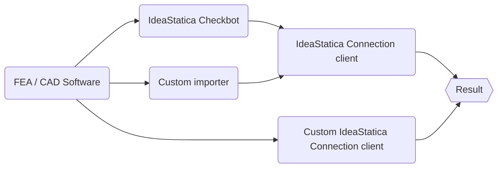

# IdeaStatiCa API
[[Examples](#) | [Docs](#) | [Manual](#) | [Wiki](#) | [Forum](#) | [Contact us](#) ]

The following should appeal to Software Developers and Computational designers wishing to interface with [IDEAStatiCa](#) applications and services.

Basicaly, there are three ways, howe to use this project :
- Create **Custom IdeaStatica Connection client**, which allows user to make calculations without need of use standard interface
 - Transfer connections between BIM / FEA software and IdeaStatica directly with **custom importer**.
 - Transfer connections to **IdeaStatica Checkbot**
>[Checkbot](#) is the preffered way, how to transfer data from FEA/BIM model to IdeaStatica. It keeps the context with model, so the user can retroactively work with imported data. 

## Getting started

I want to create link **IdeaStatica Checkbot** :  
- Walkthrough with example at [BIM Link Checkbot](#)
 
 I want to create **Custom importer** 
- Walthrough with example at [BIM Link Simple App IOM](#)
 
I want to create **IdeaStatica plugin** 
- Walthrough with example at [IDEA Plugin (API) ConnectionHiddenCheckClient](#)

## Content
This project consist of the following folders :
- IdeaRS.OpenModel
- IdeaStatiCa.BimApi
- IdeaStatica.BimApiLink
- Examples

## Contributing
We appreciate if you help us keep this project be in good condition. Please check out our [contribution rules]() 
